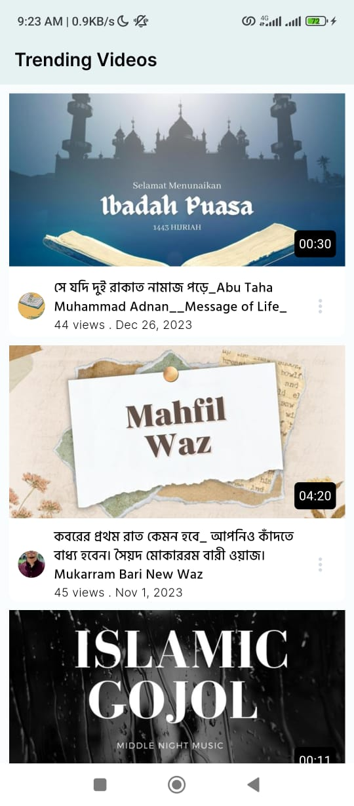
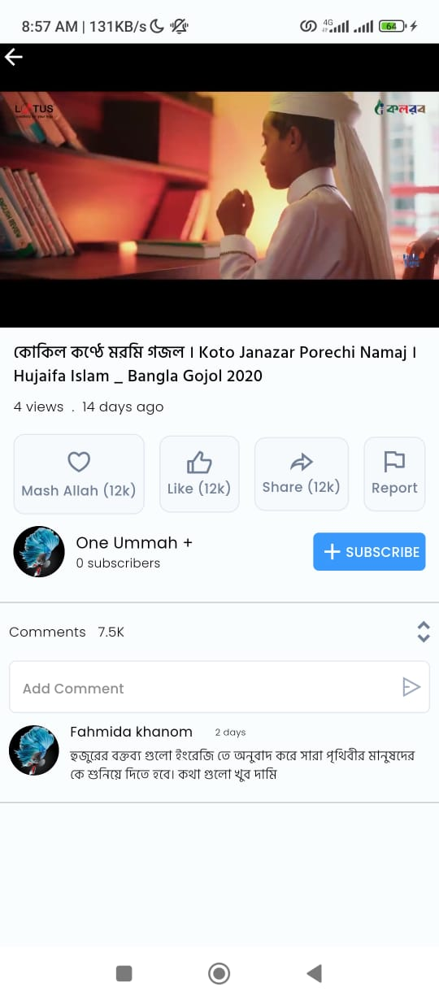

# Qtec Solution Limited Flutter Developer Hiring Test

## Overview

This Flutter project is part of the hiring process for Qtec Solution Limited. The goal of the project is to create a mobile application with two main pages:
1. List of Trending Videos
2. Video Player Page

# how to run the project
simply clone the project and run "flutter pub get" in the terminal on the root project directory
then run the project by "flutter run" in the terminal

## Project Structure

The project follows a modular structure, and key components are organized as follows:

- `lib/`: Contains the Dart source code for the application.
    - `pages/`: Holds different pages/screens of the application.
        - `video_list_page/`: Page for displaying the list of trending videos.
            - `video_list_page.dart`: Widget for the video list page.
            - `video_list_page_controller.dart`: Controller for managing the state of the video list page.
        - `video_player_page/`: Page for playing individual videos.
            - `video_player_page.dart`: Widget for the video player page.
            - `video_player_page_controller.dart`: Controller for managing the state of the video player page.
    - `global_widgets/`: Contains commonly used and repeated widgets across the app.
        - `video_card.dart`: Widget for displaying a video card in the list.
        - `global_text_view.dart`: Widget for display text.
    - `utils/`: Contains utility modules and helper functions used across the app.
        - `constants.dart`: Contain const values.
        - `utility_functions.dart`: Utility functions used across the app.
    - `api_provider/`: Contains modules for handling API requests and responses.
        - `api_provider.dart`: ApiProvider Class for making API requests.

## State Management

This project uses **GetX** for state management. The relevant files are located in the `lib/pages/` directory:

- `video_list_page_controller.dart`: Controller for managing the state of the Trending Videos screen.
- `video_player_page_controller.dart`: Controller for managing the state of the Video Player screen.

## Libraries Used

- **[get](https://pub.dev/packages/get)**: State management library for Flutter with a focus on simplicity and performance.
- **[video_player](https://pub.dev/packages/video_player)**: Flutter plugin for playing videos.
- **[http](https://pub.dev/packages/http)**: A package for making HTTP requests.

## Screenshots

